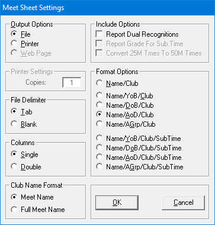

# PRN-Parser

PRN-Parser is a project by SCDS to create web based gala programmes from SPORTSYSTEMS.

## Requirements

You will need Python3 installed on your system and available on the command line.

[Install Python](https://www.python.org/downloads/) for your machine from the Python website.

## Examples

View example programmes on the Chester-le-Street ASC website;

* https://downloads.chesterlestreetasc.co.uk/galas/online-programmes/junior-meet-2019/
* https://downloads.chesterlestreetasc.co.uk/galas/online-programmes/level-x-series-1/

## Usage

### Producing a PRN File

In SPORTSYSTEMS Meet Organisation, go to `Before Meet` -> `Meet Sheet` -> `Meet`. In the dialog box that appears;



Ensure you have selected;

* Output Options: File
* File Delimiter: Tab
* Columns: Single
* Club Name Format: Meet Name

For all other options, such as Format Options, feel free to make your own choices.

### Parsing the PRN File

You should run the PRNParser script from the command line as follows. 

```bash
python3 PRNParser.py -d "/mnt/c/SPORTSYS/SSMeet/Meets/LXMeet20/reports/LX20MEET.PRN"
```

Where argument `-d` is the path to the PRN file.

This will output a file called `data.json` which will be used by the web viewer, a collection of PHP scripts which you can upload to your club's web server. *Not yet in this repo!*

Eventually, a program will be created which produces webpages for you, in a static format that you can upload to your club website.
